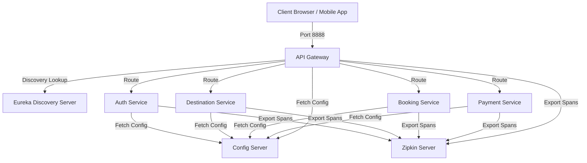

# Agent Travel Microservices Suite

A robust, highly resilient, observable, and containerized microservices ecosystem designed for managing travel agent bookings, auth, destinations, and payments. This suite is built using **Spring Boot 3.3.4**, **Spring Cloud 2023.0.3**, **Resilience4j**, **Micrometer Tracing**, and **Docker**.

---

## Architectural Pillars

### 1. Dynamic Service Discovery & Registry (Eureka)
*   **Module:** `discovery-server` (Port `8761`)
*   Every microservice registers dynamically with Eureka at startup. The API Gateway utilizes Eureka's service registry to load-balance (`lb://`) requests across healthy instances, completely eliminating hardcoded IP addresses or ports.

### 2. Centralized Configuration (Config Server)
*   **Module:** `config-server` (Port `8889`)
*   Hosts all configuration profiles locally in a central classpath location (`shared-configs/`). Microservices dynamically fetch their database, security, and integration parameters at startup, supporting dynamic runtime profile updates.

### 3. Fault Tolerance & Resiliency (Resilience4j)
*   Integrates **Resilience4j Circuit Breakers** to protect critical service paths from third-party outages or network delays:
    *   **Google OAuth API:** Guarded by the `googleAuth` circuit breaker inside `auth-service`.
    *   **Midtrans Payment API:** Guarded by the `midtrans` circuit breaker inside `payment-service`.
*   Includes automated fallback methods that return gracefully mocked tokens or trigger offline workflows during partner API downtime.

### 4. Distributed Tracing & Observability (Micrometer + Zipkin)
*   Implements **Micrometer Tracing** (replacing Spring Cloud Sleuth in Spring Boot 3.x) with an **OpenTelemetry (OTel)** bridge.
*   Inter-service HTTP calls are injected with standard W3C trace propagation headers (`traceparent`), allowing Zipkin (Port `9411`) to visually trace a request's journey across service boundaries.

### 5. Advanced Containerization (JVM & Spring Native)
*   **JVM Multi-Stage Dockerfiles:** High-speed development builds utilizing Maven caching (`dependency:go-offline`) inside Docker to reuse compiled dependency layers, running on minimal `eclipse-temurin:21-jre-alpine` runtimes.
*   **GraalVM Spring Native Image Support:** Included `Dockerfile.native` configuration to compile Spring Boot bytecode ahead-of-time (AOT) to static machine binaries. This cuts container RAM usage to a tiny **30MB** and enables instant start times (under **50ms**).

---

## System Architecture & Port Allocations



| Service Name | Port | Description |
| :--- | :--- | :--- |
| **API Gateway** | `8888` | Entry point, JWT token verification, dynamic route load-balancing. |
| **Eureka Server** | `8761` | Service discovery registry dashboard. |
| **Config Server** | `8889` | Centralized configurations manager (`native` profile). |
| **Auth Service** | `8081` | JWT creation, user registration, local & Google Login integration. |
| **Booking Service** | `8082` | Booking CRUD operations and status management. |
| **Destination Service** | `8083` | Travel destination catalogue management. |
| **Payment Service** | `8084` | Payment integration charging via Midtrans Snap Token APIs. |
| **Zipkin Tracing** | `9411` | Visual distributed tracing collection dashboard. |

---

## Running the Cluster

We provide three different pathways to run this microservice ecosystem:

### Pathway A: Running with Docker Compose (Highly Recommended)
We use a **deterministic startup sequence** using Docker healthcheck policies to ensure Eureka and Config Server are fully healthy before client microservices attempt to boot.

1.  **Start all services and build images:**
    ```bash
    docker compose up --build
    ```
2.  **Verify container health:**
    ```bash
    docker compose ps
    ```
3.  **Shut down the cluster:**
    ```bash
    docker compose down
    ```

---

### Pathway B: Running Locally (Traditional JVM Shell Scripts)
If you want to run the services directly on your host machine without containerization, we've provided automated boot and teardown scripts.

1.  **Build all JARs:**
    ```bash
    mvn clean package -DskipTests
    ```
2.  **Start all services in the background:**
    ```bash
    ./run-all.sh
    ```
3.  **Stop all background services instantly:**
    ```bash
    ./stop-all.sh
    ```

---

### Pathway C: Compiling to GraalVM Native Images (Production / Scaling)
If you wish to compile the services to standalone, ultra-low memory native binaries:

1.  **Build the docker image using the native profile:**
    ```bash
    docker compose -f docker-compose.yml -f docker-compose.native.yml build
    ```
2.  **Run native containers:**
    ```bash
    docker compose -f docker-compose.yml -f docker-compose.native.yml up
    ```

---

## Observability & Resilience Testing

### 1. View Distributed Traces
*   Open the **Zipkin Dashboard** at `http://localhost:9411`.
*   Trigger endpoints (e.g., booking creation or auth signup) via API Gateway on `http://localhost:8888/api/...`.
*   Search for spans in Zipkin to see the timing, latency breakdown, and network propagation headers across Gateway and child microservices.

### 2. View Registered Services
*   Open the **Eureka Discovery Server Dashboard** at `http://localhost:8761`.
*   Monitor service counts, IP addresses, uptime, and lease thresholds.

### 3. Verify Circuit Breakers
*   To test Resilience4j fault tolerance, disconnect your internet connection (simulating Google API downtime) and try registering or logging in using a Google ID token.
*   `auth-service` will seamlessly catch the connection timeout, trigger the `googleAuth` circuit breaker, and execute the `googleAuthFallback` method, safely returning a fallback traveler profile instead of crashing.
